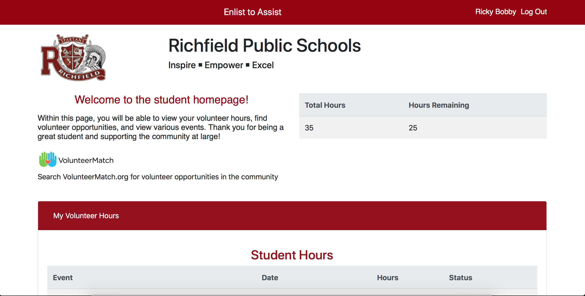
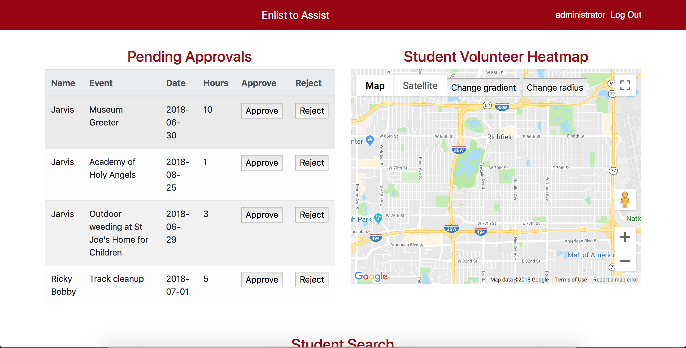

# Enlist to Assist

# Description

Application designed to make the volunteer work done by high school students easier to track and find. Seperate pages have been created based on whether the individual is a student or faculty. 

On the student page, individuals are able to track total volunteer hours and submit completed volunteer hours. Students are also able to see upcoming events in their area that they are able to volunteer at. A map is provided to give context as to the distance to the location from where they live or their school. 

Faculty will be directed to an admin page that will allow them to over see and track the volunteers hours. Users will be able to search for specific students, bringing up basic information and volunteer hours status. Hours submited by students will be able to be reviewed and approved. A heat map will be provided which keeps track of locations that have recieved the most volunteer insterest.

# Technologies Used

- Javascript 
- Firebase
- JQuery
- Moment.JS
- Google Maps API
- Google Calender API
- Bootstrap
- CSS 

# Login Page

# Student Page

# Faculty Page
